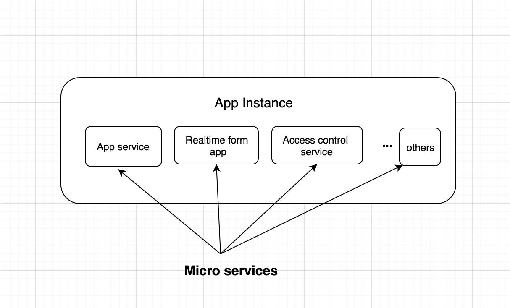

# Multi-Tenant Software-as-a-Service Architecture

Figure 1: A simple multi tenant application using a fully distributed data model

### Solution

In building a multi-tenant Software-as-a-Service application, such application should be able to serve multiple users commonly called tenants. To achieve a well architected system, the following will need to be considered before building this application:

- Data management

- Access control system 

- Performance 

- Storage 

- Security 
  

### Monolithic or Micro-Services

This app will be built using a micro-service architecture. A monolithic can work but scaling it will be hard. The decision to use a microservices architecture is to separate concerns and also to be able to manage and scale individual services. Simply because of separation of concern and also to make it easy to manage scale the real time aspect of the application. See figure below.

Figure 2: A diagram of the application instance of the Multi-tenant Application

### Data Management

For a new SaaS application with a limited number of tenants, one could start using the monolithic model for storing all data, and move to fully distributed model as the amount of tenants and data grows. The monolithic model will be easier to implement with lower costs, as only a single database instance is needed. The fully distributed model on the other hand is more flexible and scalable, with guaranteed data isolation, but at a higher price. See figure 1 above for more illustration.

For database of choice, I will prefer a document-oriented database like MongoDB. This is because of the flexible nature of the data. 
  

### Tech Stack

Popular languages like Python, NodeJS, Java, Ruby, Golang, Obj-C, Swift, and .NET are capable of building this kind of application. My preference will NodeJS since it allows us to create data-intensive real-time applications that run across distributed devices and it is fast. A close 2nd will be GoLang because it also fast.

### Managing Real Time process

This depends on the technology we are using to build this application. Since my preference is NodeJS, I may use the [JavaScript Event source API](https://developer.mozilla.org/en/docs/Web/API/EventSource) to build and manage this part of the application. Building a ‘realtime’ infrastructure by oneself can be hard, can get expensive, and it’s a large burden on development time. And once it’s built, one has to maintain and scale that network.

My approach will be to use a data streaming service like Apache Kafka, PubNub, et.c which have been built and globally scaled for developers. This saves time and money and allow one to focus on the main application.

### Security

As with any other application, one may want to secure these applications with user authentication and user permissions.

**Access Control:** To protect data from other tenants, one has to build a robust access control system that isolates each tenant's data to provide a suitable level of protection.For example, given the list below, tenant A should not have access to data in tenant B and vice versa. Also each tenant should have at least one administrator that can manage only users in their respective group.

- Tenant A 
    - HR 
        - Talent Recruitment 
        - People Management 

    - Finance 
    - Operations 
    - IT 

- Tenant B 
- Tenant C 
  

In the case of form creation, the creator of the form has administrative right and can give access to any one in the same group.

**Encryption:** Another way to secure user data is to encrypt them. For instance, to save credit card information, the credit card information has to be encrypted. The encryption key can be saved in a different database from the one that will save the credit card information.